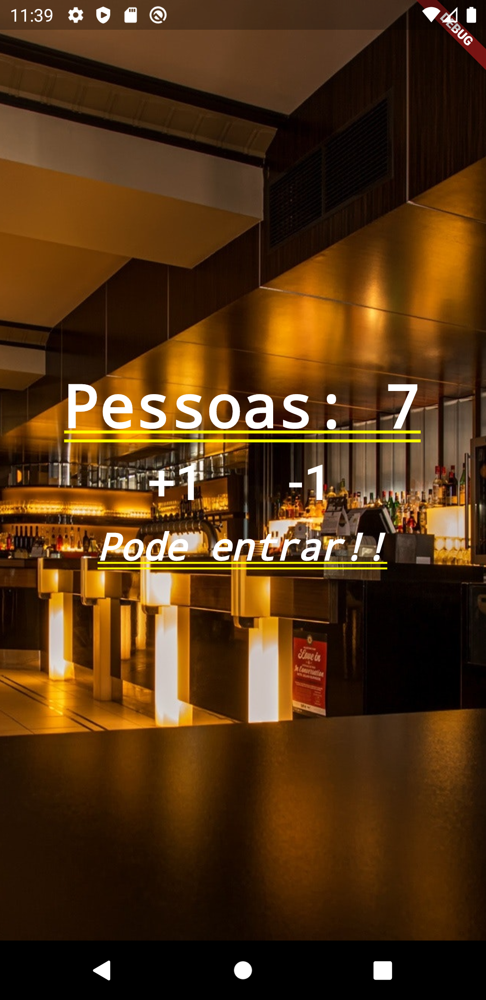
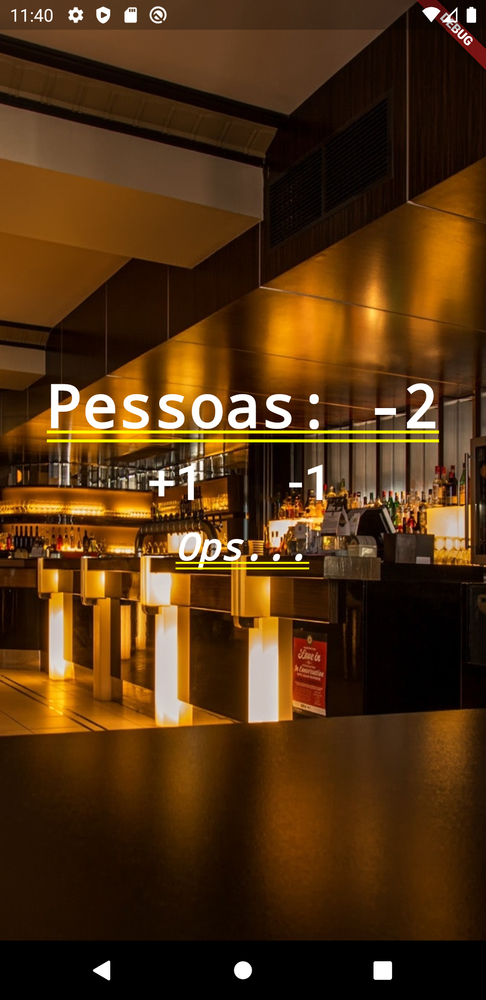
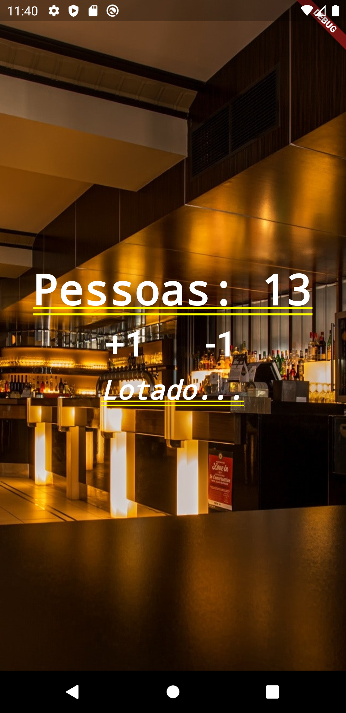

# Contador de Pessoas

A simple app to begin the development of Flutter.
This project approach basic concepts as Widgets (statefuls and stateless), OOP, inheritance of widgets, use of assets ...

## Getting Started

This project is a starting point for a Flutter application.

A few resources to get you started if this is your first Flutter project:

- [Lab: Write your first Flutter app](https://flutter.dev/docs/get-started/codelab)
- [Cookbook: Useful Flutter samples](https://flutter.dev/docs/cookbook)

For help getting started with Flutter, view our
[online documentation](https://flutter.dev/docs), which offers tutorials,
samples, guidance on mobile development, and a full API reference.

## Prints

